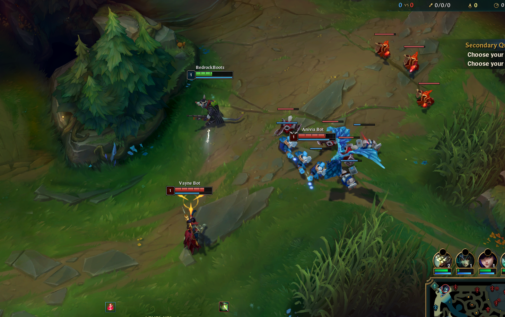
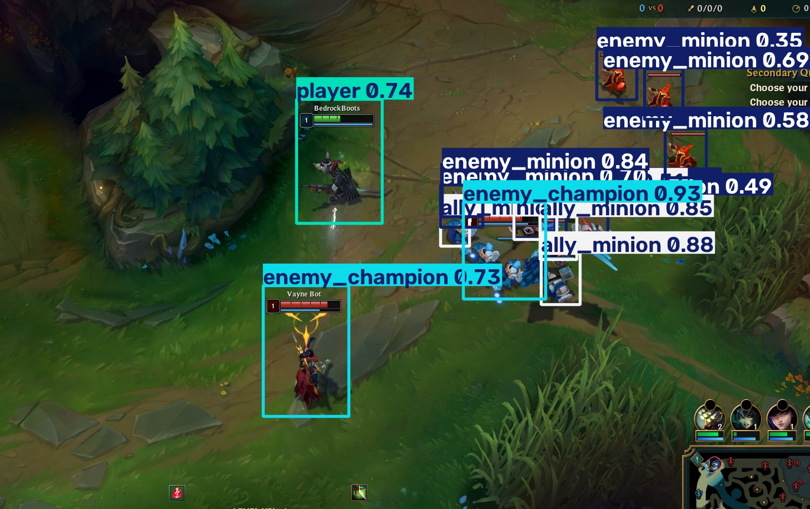

# LoL Positioning Engine

YOLOv8-based object detection for League of Legends gameplay. Detects champions and minions in screenshots / screen capture and streams annotated frames.




## What it does

Takes LoL gameplay footage and outputs bounding boxes + coordinates for:

- `player` — your champion
- `ally_champion` / `enemy_champion`
- `ally_minion` / `enemy_minion`

Base model is `yolov8n`, fine-tuned on custom annotated frames. Weights live in `weights/best.pt` (~6 MB).

## Layout

```text
lol-positioning-engine/
├── weights/
│   └── best.pt        # trained weights
├── dataset.yaml       # train/val paths + class names
├── train.py           # fine-tune yolov8n
├── predict.py         # run on image / video file
├── real-time.py       # screen capture -> MJPEG stream on :5000
├── test_original.png  # sample input
├── test_predicted.jpg # sample output
└── README.md
```

`runs/` is YOLO output (ignored by git).

## Setup

```bash
pip install ultralytics opencv-python flask mss numpy
# or
pip install -r requirements.txt
```

Python 3.10+.

## Dataset

`dataset.yaml` defines the classes and split:

```yaml
path: .  # dataset root
train: images/train
val: images/val

names:
  0: ally_champion
  1: enemy_champion
  2: ally_minion
  3: player
  4: enemy_minion
```

Put YOLO-format images/labels under `images/train`, `images/val` (with matching `labels/train`, `labels/val`). Then:

```bash
python train.py
```

`train.py`:

```python
from ultralytics import YOLO

if __name__ == "__main__":
    model = YOLO("yolov8n.pt")
    model.train(data="dataset.yaml", epochs=100)
```

## Inference on a file

```bash
python predict.py
```

`predict.py`:

```python
from ultralytics import YOLO

if __name__ == "__main__":
    model = YOLO("./weights/best.pt")
    # This would normally run on gpu but using cpu for simplicity
    results = model.predict(source="test_original.png", save=True, device="cpu")
```

Change `source=` to your screenshot (`test_original.png`) or a clip (`.mp4`, `.webm`). Output goes to `runs/detect/predict/`.

Example:

```python
results = model.predict(source="test_original.png", save=True, device="cpu")
```

## Real-time

```bash
python real-time.py
```

Then open `http://localhost:5000` to view the annotated stream.

`real-time.py` grabs the screen with `mss` (1920x1080 by default — edit the `monitor` dict for your window), runs `model.track(..., conf=0.5, tracker="botsort.yaml")`, and serves MJPEG via Flask.

## Notes

- Training was done on CPU for simplicity. Use `device=0` if you have CUDA.
- `real-time.py` uses a hyphenated filename, so run it as a script (`python real-time.py`), not as an import.

